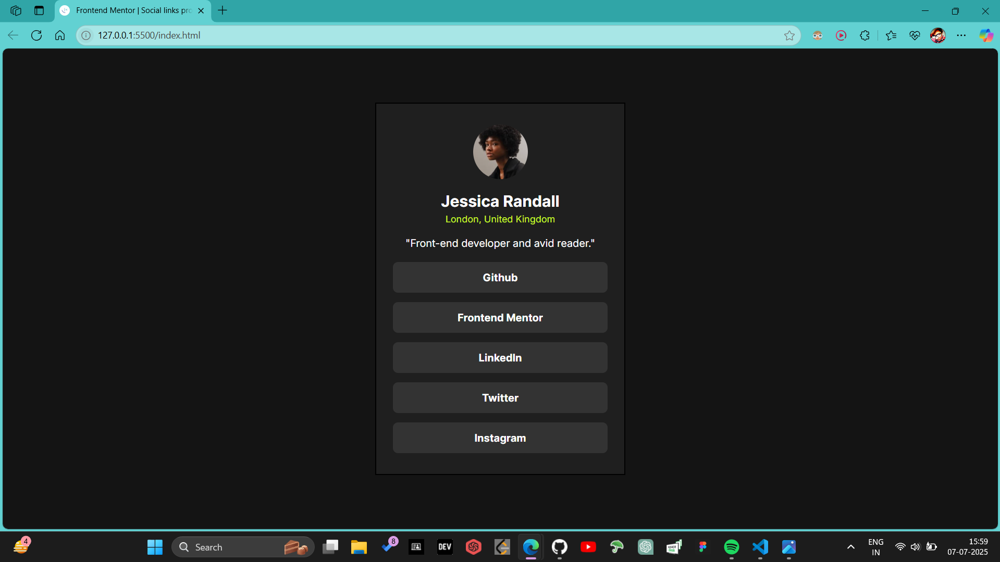
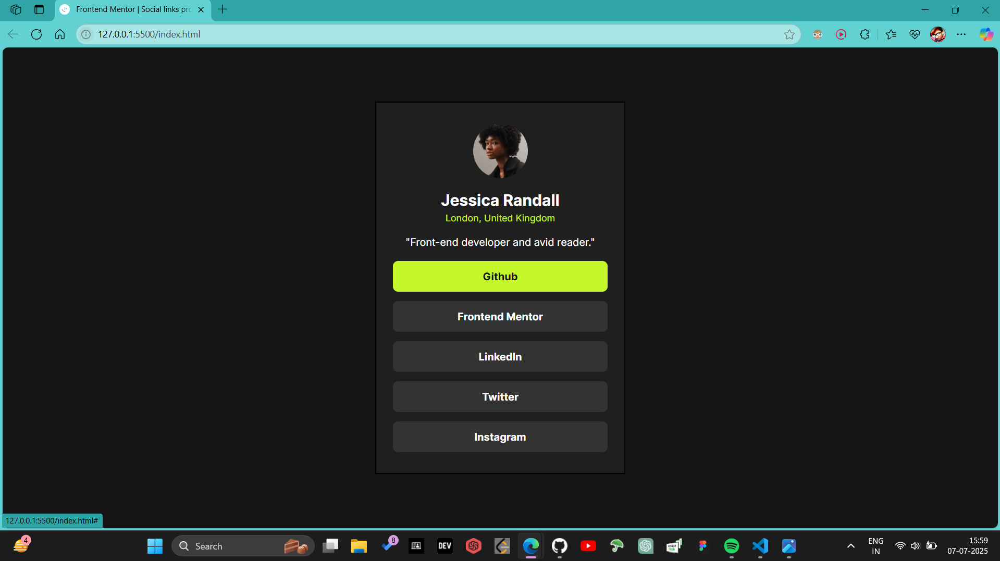
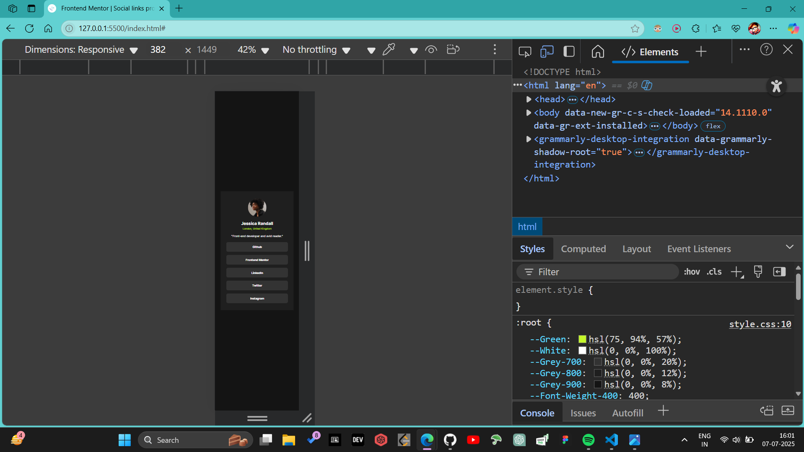

# Frontend Mentor - Social links profile solution

This is a solution to the [Social links profile challenge on Frontend Mentor](https://www.frontendmentor.io/challenges/social-links-profile-UG32l9m6dQ). Frontend Mentor challenges help you improve your coding skills by building realistic projects.

## Table of contents

- [Overview](#overview)
  - [The challenge](#the-challenge)
  - [Screenshot](#screenshot)
  - [Links](#links)
- [My process](#my-process)
  - [Built with](#built-with)
  - [What I learned](#what-i-learned)
  - [Continued development](#continued-development)
  - [Useful resources](#useful-resources)
- [Author](#author)

## Overview

### The challenge

Users should be able to:

- View the optimal layout for the site depending on their device's screen size
- See hover and focus states for all interactive elements on the page

### Screenshot





### Links

- 🔗 [Solution URL](https://github.com/MSAndromeda/social-links-profile)
- 🔗 [Live Site URL](https://msandromeda.github.io/social-links-profile/)

## My process

### Built with

- Semantic HTML5 markup
- CSS custom properties
- Flexbox
- Mobile-first workflow
- Accessibility considerations (`prefers-reduced-motion`)

### What I learned

This project helped reinforce my understanding of semantic HTML, responsive layout using Flexbox, and improving accessibility with motion preferences.

```css
@media (prefers-reduced-motion: reduce) {
  li > a {
    transition: none !important;
  }
}
```

```css
body {
  font-size: clamp(0.8rem, 2vw, 1rem);
}
```

### Continued development

In future projects, I want to:

- Improve animation accessibility across all interactive components
- Use CSS Grid for advanced layout systems
- Deepen my understanding of scalable and component-driven design systems
- Optimize responsiveness with modern CSS techniques

### Useful resources

- [MDN Web Docs – prefers-reduced-motion](https://developer.mozilla.org/en-US/docs/Web/CSS/@media/prefers-reduced-motion)
- [CSS Tricks – clamp() for fluid typography](https://css-tricks.com/linearly-scale-font-size-with-css-clamp-based-on-the-viewport/)
- [Frontend Mentor Community](https://www.frontendmentor.io/)

## Author

- Frontend Mentor – [@MSAndromeda](https://www.frontendmentor.io/profile/MSAndromeda)
